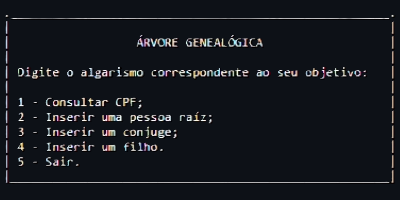

<h1 align="center" style="font-weight: bold;">Árvore Genealógica 👨‍👩‍👧‍👦</h1>

 <a href="#tech">Tecnologias</a> •
 <a href="#started">Como Testar</a>

    <b>Um projeto de tecnólogo que utiliza de conceitos de estrutura de dados para construir uma árvore genealógica, utilizando nós e listas.</b>

     <a href="https://www.jdoodle.com/ia/1HRL">💻 Visite esse projeto</a>

<h2 id="layout">🎨 Layout</h2>

    
    <!--  -->

<h2 id="technologies">💻 Technologies</h2>

<h2 id="started">🚀 Como Testar</h2>

Aqui estão algumas instruções para testar o projeto rapidamente:
1. Acesse o link do projeto:
https://www.jdoodle.com/ia/1HRL  
2. Clique no botão "Execute" no canto superior direito da tela para executar o código.  
  
3. Em seguida, posicione o cursor sobre os 3 pontos no canto superior direito da tela ao lado de "Input/Output" e clique em "Maximize".  
  
4. Por fim, clique no canto inferior do terminal e siga os passos que o sistema te fornecer.  
  

<h3>Pré-requisitos</h3>

- Java 8 ou superior

