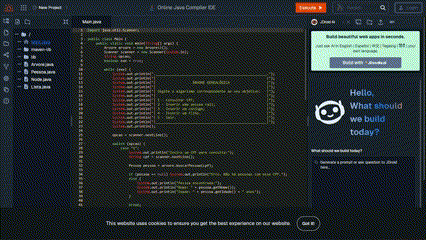
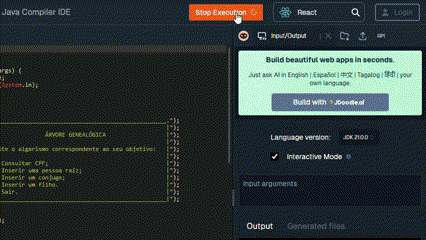
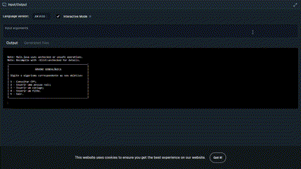

<h1 align="center" style="font-weight: bold;">Árvore Genealógica 👨‍👩‍👧‍👦</h1>

 <a href="#technologies">Tecnologias</a> •
 <a href="#started">Como Testar</a>

    <b>Um projeto de tecnólogo que utiliza de conceitos de estrutura de dados para construir uma árvore genealógica, utilizando nós e listas.</b>

     <a href="https://www.jdoodle.com/ia/1HRL">💻 Visite esse projeto 💻</a>

<h2 id="layout">🎨 Layout</h2>

<pre align="center" style="font-size: clamp(10px,1.2vw,15px); text-wrap: nowrap;">
.______________________________________________________.
|                                                      |
|                  ÁRVORE GENEALÓGICA                  |
|                                                      |
| Digite o algarismo correspondente ao seu objetivo:   |
|                                                      |
| 1 - Consultar CPF;                                   |
| 2 - Inserir uma pessoa raíz;                         |
| 3 - Inserir um conjuge;                              |
| 4 - Inserir um filho.                                |
| 5 - Sair.                                            |
|______________________________________________________|
</pre>

<h2 id="technologies">💻 Tecnologias</h2>

<h2 id="started">🚀 Como Testar</h2>

Aqui estão algumas instruções para testar o projeto rapidamente:

<b>1.</b> Acesse o link do projeto:
https://www.jdoodle.com/ia/1HRL  
<b>2.</b> Clique no botão "Execute" no canto superior direito da tela para executar o código.  
  
<b>3.</b> Em seguida, posicione o cursor sobre os 3 pontos no canto superior direito da tela ao lado de "Input/Output" e clique em "Maximize".  
  
<b>4.</b> Por fim, clique no canto inferior do terminal e siga os passos que o sistema te fornecer.  
  

<h3>Pré-requisitos</h3>
🌐Teste online pelo link acima:
 <b>

- PC ou notebook com acesso à internet
</b>
💻Teste local: <b>

- Java 8 ou superior
</b>
 
